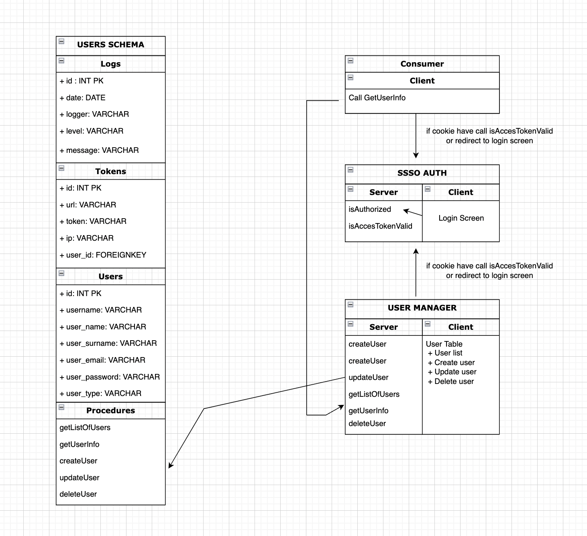

# AloTech FullStack Bootcamp SSO Project

Single sign-on (SSO) is a session and user authentication service that permits a user to use one set of login credentials to access multiple applications. A token is generated, which can be stored in cookies or in the url. And this token is used for cross-service security.SSO can be used by enterprises, smaller organizations and individuals to ease the management of various usernames and passwords.


<p align="center">
    
</p>

---
# SSO Auth
isAuthorized method, verify to username and password for login. If information is correct,response (true,user_id,token) or (false) isAccessTokenValid method, Control the acees token valid. Is token valid response same token. İf user token is expired, new token will be generated and response will be new token. 

# User Manager 
Page is first loaded, check access token is valid or not. If there is not access token redirect  sso-auth login page. If have a access token  check validation with sso-auth isAccessTokenValid method. If authenticated user_type is admin,then show this page.
Features :  Get user list
                Create new user
                Update user
                Delete user

# Consumer 
Page is first loaded, check access token is valid or not. If there is not access token redirect sso-auth login page. If have a access token  check validation with sso-auth isAccesTokenValid method. If authenticated user_type is admin,then show this page. Call getUserInfo method from user manager to get user information.

---

## Tech & Libraries
* [ReactJS](https://reactjs.org/)
* [Bootstrap](https://getbootstrap.com/)
* [Reactstrap](https://reactstrap.github.io/)
* [Formik](https://formik.org/)
* [NodeJS](https://nodejs.org/)
* [ExpressJS](https://expressjs.com/)
* [Mocha](https://mochajs.org/)
* [MySQL](https://www.mysql.com/)
* [JSON Web Token](https://github.com/auth0/node-jsonwebtoken)
* [Winston](https://github.com/winstonjs/winston)
---

## Instructions

### First of all import users.sql file to your sql database for table and stored procedures.
+ sso-auth/server/config.js file is the configuration file your database. You can change the database name,user,password,host,port.
  
+ user-manager/server/config.js file is the configuration file your database. You can change the database name,user,password,host,port.

First clone this repository.
```bash
$ git clone https://github.com/AloTech-SSO-Project/user-manager.git
$ cd user-manager
```

sso-auth
```bash
$ cd sso-auth

$ cd server
$ npm install
$ npm start

$ cd client
$ npm install
$ npm start
```

user-manager
```bash
$ cd user-manager

$ cd server
$ npm install
$ npm start

$ cd client
$ npm install
$ npm start
```

consumer
```bash
$ cd consumer
$ npm install
$ npm start
```
---
## API Documentation
#### [ Sso Auth API Documentation ](https://github.com/AloTech-SSO-Project/sso-project-group-4/blob/main/sso-auth/server/README.md)
#### [ User Manager API Documentation ](https://github.com/AloTech-SSO-Project/sso-project-group-4/tree/main/user-manager/server)
---
## For try the application you can use this information :  
+ For admin login : 
    username : admin - 
    password : Qweasd12.
+ For user login : 
    username : user1 - 
    password : Qweasd12.

---

## Contributors

- [Çağatay Çürük](https://github.com/cagatay135)

- [Yılmaz Canpolat](https://github.com/ylmzcanpolat)

- [Berkan Ankal](https://github.com/berkanankal)
